<div align="center">


<br>


<br><br>


</div>


# `01 // ABOUT_ME`

text
┌──────────────────────────────────────────────────────────────┐
│                    DEVELOPER PROFILE                         │
├──────────────────────────────────────────────────────────────┤
│                                                              │
│  > Name: Jonathan                                            │
│  > Username: jonathan-jow                                    │
│  > Role: Systems Development Student                         │
│  > Focus: Software Engineering & Cybersecurity               │
│  > Environment: Linux                                       │
│  > Current Mode: Learning / Building / Exploring             │
│                                                              │
│  "Transforming ideas into systems, one line at a time."      │
│                                                              │
└──────────────────────────────────────────────────────────────┘

Olá! 👋

Sou estudante de Desenvolvimento de Sistemas, apaixonado por tecnologia, programação, inteligência artificial e segurança.

Gosto de explorar novas tecnologias, criar projetos e transformar ideias em aplicações reais.

Atualmente estou focado em:
🤖 Inteligência Artificial
💻 Desenvolvimento Web
🔐 Cybersecurity
🐧 Linux
⚙️ Backend & APIs
🧠 Automação
🚀 Projetos com IA
02 // TECH_STACK
<div align="center">
``
LANGUAGES

FRONTEND

BACKEND & DATABASE

AI & DATA

SYSTEM & DEVOPS
 </div>
03 // TOOLKIT
<div align="center">
TOOL	PURPOSE
🐧 Linux	Development environment
💻 VS Code	Code editor
🐙 GitHub	Version control
🌐 Git	Source management
🐳 Docker	Application environments
⚡ Vite	Frontend tooling
🔥 Supabase	Backend & database
🧠 AI Tools	AI development & prototyping
⌨️ Terminal	Automation & system management
</div>
04 // FEATURED_PROJECTS
<div align="center"> <a href="https://github.com/jonathan-jow">  </a> </div> <br>
🤖 Nutri AI

Intelligent nutrition assistant developed as a technology project.

Features
🤖 AI Chat
🍽️ Meal analysis
📊 Nutritional information
🛒 Smart shopping lists
💡 Personalized recommendations
Stack

HTML CSS JavaScript AI APIs

⚡ Future Projects
┌──────────────────────────────────────────────────────────────┐
│                    PROJECT ROADMAP                           │
├──────────────────────────────────────────────────────────────┤
│                                                              │
│  [01] AI Assistant                                           │
│  [02] Cybersecurity Toolkit                                  │
│  [03] Personal Automation System                             │
│  [04] Intelligent Dashboard                                  │
│  [05] AI-powered Web Applications                            │
│  [06] Linux Security Tools                                   │
│                                                              │
└──────────────────────────────────────────────────────────────┘
05 // CURRENT_MISSION
$ ./mission_control.sh

[■■■■■■■■■■■■■■■■■■■■] 100%

> Loading objectives...

✓ Learn advanced JavaScript
✓ Improve backend development
✓ Build real-world applications
✓ Explore Artificial Intelligence
✓ Study cybersecurity
✓ Improve Linux administration
✓ Build scalable projects
✓ Create useful AI-powered applications

> CURRENT MISSION:

[ SYSTEM MESSAGE ]

Keep learning.
Keep building.
Keep experimenting.

STATUS: ACTIVE

06 // GITHUB_ANALYTICS
<div align="center"> 
 </div> <br> <div align="center">  </div>
07 // ACTIVITY_GRAPH
<div align="center">  </div>
08 // GITHUB_TROPHIES
<div align="center">  </div>
09 // CONTRIBUTION_PROTOCOL
<div align="center">  </div>
10 // SOCIAL_NETWORK
<div align="center"> <a href="https://github.com/jonathan-jow">  </a> <a href="https://instagram.com/rochajow">  </a> <a href="https://www.linkedin.com/in/jonathan-rafaell/">  </a> <a href="mailto:jonathanff2009@gmail.com">  </a> </div>
11 // SYSTEM_INFORMATION
╔══════════════════════════════════════════════════════════╗
║                     SYSTEM INFORMATION                   ║
╠══════════════════════════════════════════════════════════╣
║                                                          ║
║  Developer        : Jonathan                             ║
║  GitHub           : jonathan-jow                         ║
║  Main Focus       : Software Development                  ║
║  Secondary Focus  : Cybersecurity                         ║
║  AI               : ████████████████░░ 80%               ║
║  Web Development  : █████████████████░ 90%               ║
║  Security         : ███████████░░░░░░░ 60%               ║
║  Linux            : ███████████████░░░ 80%               ║
║                                                          ║
║  SYSTEM STATUS    : ONLINE                               ║
║                                                          ║
╚══════════════════════════════════════════════════════════╝
12 // PHILOSOPHY
<div align="center">
> BUILD. LEARN. BREAK. FIX. REPEAT.
<br>

"The best way to predict the future is to build it."

</div>
<div align="center">  <br>  </div> ```
